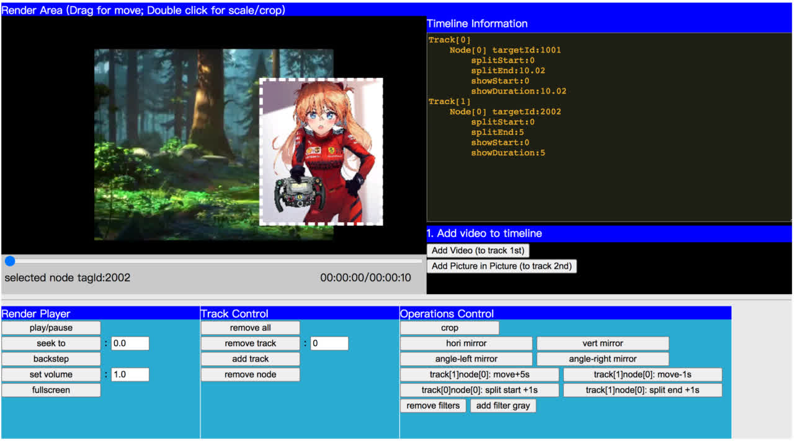
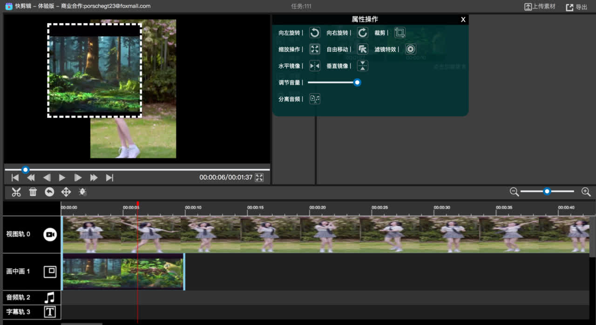

# video-editor-render-web (VER-web)

> VER-web 是一个视频编辑图形渲染框架,支持多图层、内置Timeline结构进行渲染和预览.
> 
> 适用于任何非线性编辑产品，可跨平台集成。

渲染框架调试页面 [sdk-render-index.html](sdk-render-index.html)



# 成套非线性编辑产品 - 样例

* [http://39.106.146.94/ 点击体验](http://39.106.146.94/)

* <strong>商业合作 : porschegt23@foxmail.com  (麦女生)</strong>



# API DOCS (2 MySelf)

# API

## 1) window ##

### API: window.CYL_createVideoEditRender
* Function
```c
let controllerAVC = window.CYL_createVideoEditRender(config);
```

* Params
```c
const config = {
    PlayerContId: "render1",
    APP_CANVAS_W: 640,
    APP_CANVAS_H: 360,
    LOADING_GIF: "dist-sdk/assets/icon-loading.gif"
}
```

* Return
```c
controllerAVC
```

## 2) render object ##

### API: controllerAVC.main()
* Function
```c
controllerAVC.main();
```

* Params
```c
void
```

* Return
```c
true/false
```

### API: controllerAVC.createTrace()
* Function
```c
controllerAVC.createTrace();
```

* Params
```c
void
```

* Return
```c
int 0/-1
```

### API: controllerAVC.pushNodeByIdx(0, materialList[0])
* Function
```c
controllerAVC.pushNodeByIdx(0, materialList[0]);
```

* Params
```c
1) int: track index
2) MaterialObject: material object
```

* Return
```c
int 0/-1
```


### API: controllerAVC.getMaxTraceLen()
* Function
```c
controllerAVC.getMaxTraceLen();
```

* Params
```c
void
```

* Return
```c
int track count
```


### API: controllerAVC.dumpMat(record=true/false)
* Function
```c
controllerAVC.dumpMat(record=true/false);
```

* Params
```c
record=true/false
```

* Return
```c
Track Object
```

### API: controllerAVC.setLoadingMask(show=true/false)
* Function
```c
controllerAVC.setLoadingMask(show=true/false);
```

* Params
```c
show=true/false
```

* Return
```c
int 0/-1
```

### API: reloadAllTraces(matTimeline)
* Function
```c
reloadAllTraces(matTimeline);
```

* Params
```c
matTimelineObject (参考dumpMat返回值)
```

* Return
```c
void
```

### API: getShowMaxDuration()
* Function
```c
getShowMaxDuration();
```

* Params
```c
void
```

* Return
```c
double
```


### API: seek(pts=0.0)
* Function
```c
seek(double);
```

* Params
```c
double pts
```

* Return
```c
int 0/-1
```

### API: autoPlayPause()
* Function
```c
autoPlayPause();
```

* Params
```c
void
```

* Return
```c
int 0(to play)/1(to pause)
```


### API: play()
* Function
```c
play();
```

* Params
```c
void
```

* Return
```c
void
```


### API: pause()
* Function
```c
pause();
```

* Params
```c
void
```

* Return
```c
void
```


### API: backStep()
* Function
```c
backStep();
```

* Params
```c
void
```

* Return
```c
void
```


### API: removeAll()
* Function
```c
removeAll();
```

* Params
```c
void
```

* Return
```c
void
```


### API: removeAll(trackIdx=0)
* Function
```c
removeTraceByIdx(int);
```

* Params
```c
int
```

* Return
```c
void
```


### API: removeRect()
* Function
```c
removeRect();
```

* Params
```c
void
```

* Return
```c
void
```


### API: createTrace(size=-1)
* Function
```c
createTrace(int);
```

* Params
```c
int
-1 : add 1 track
> 0: size=all track size
```

* Return
```c
int 0/-1
```


### API: rmNodeByTagId(tagId)
* Function
```c
rmNodeByTagId(int);
```

* Params
```c
int
```

* Return
```c
int 0/-1
```


### API: rmNodeByTraceIdxNodeIdx(traceIdx, nodeIdx)
* Function
```c
rmNodeByTraceIdxNodeIdx(int traceIdx, int nodeIdx);
```

* Params
```c
int traceIdx, int nodeIdx
```

* Return
```c
int 0/-1
```

### API: getCanvasNodeTagID(tagId)
* Function
```c
getCanvasNodeTagID(int);
```

* Params
```c
int
```

* Return
```c
node object
```


### API: exitRoiRect()
* Function
```c
exitRoiRect();
```

* Params
```c
void
```

* Return
```c
void
```


### API: fullScreen()
* Function
```c
fullScreen();
```

* Params
```c
void
```

* Return
```c
void
```


### API: closeFullScreen()
* Function
```c
closeFullScreen();
```

* Params
```c
void
```

* Return
```c
void
```

### API: beginCrop(tagId)
* Function
```c
beginCrop(int);
```

* Params
```c
int
```

* Return
```c
void
```

### API: set_tag_GL_MvHoriMirror(tagId)
* Function
```c
set_tag_GL_MvHoriMirror(int);
```

* Params
```c
int
```

* Return
```c
void
```


### API: set_tag_GL_MvVertMirror(tagId)
* Function
```c
set_tag_GL_MvVertMirror(int);
```

* Params
```c
int
```

* Return
```c
void
```


### API: reset_tag_GL_HoriMirror(tagId)
* Function
```c
reset_tag_GL_HoriMirror(int);
```

* Params
```c
int
```

* Return
```c
void
```


### API: reset_tag_GL_VertMirror(tagId)
* Function
```c
reset_tag_GL_VertMirror(int);
```

* Params
```c
int
```

* Return
```c
void
```


### API: angleTurn(right=true);
* Function
```c
angleTurn(bool);
```

* Params
```c
bool true:right false:left
```

* Return
```c
void
```


### API: moveByTraceIdxNodeIdx(traceIdx, nodeIdx, moveMv)
* Function
```c
moveByTraceIdxNodeIdx(int traceIdx, int nodeIdx, float moveMv);
```

* Params
```c
int traceIdx, int nodeIdx, float moveMv
```

* Return
```c
int 0/-1
```


### API: splitNodeByTraceIdxNodeIdx(int traceIdx, int nodeIdx, float startMv, float endMv)
* Function
```c
splitNodeByTraceIdxNodeIdx(int traceIdx, int nodeIdx, float startMv, float endMv);
```

* Params
```c
int traceIdx, int nodeIdx, float startMv, float endMv
```

* Return
```c
int 0/-1
```


### API: addShader(shaderName)
* Function
```c
addShader(shaderName);
```

* Params
```c
const SHADER_NAME_DEFAULT       = "default";
const SHADER_NAME_GRAY          = "gray";
const SHADER_NAME_MIRROR_HORI   = "mirrorhori";
const SHADER_NAME_MIRROR_VERT   = "mirrorvert";

Enum shaderName

Example: SHADER_INTERFACE.SHADER_NAME_GRAY
```

* Return
```c
int 0/-1
```


### API: rmShader(shaderName)
* Function
```c
rmShader(shaderName);
```

* Params
```c
const SHADER_NAME_DEFAULT       = "default";
const SHADER_NAME_GRAY          = "gray";
const SHADER_NAME_MIRROR_HORI   = "mirrorhori";
const SHADER_NAME_MIRROR_VERT   = "mirrorvert";

Enum shaderName

Example: SHADER_INTERFACE.SHADER_NAME_GRAY
```

* Return
```c
int 0/-1
```


### API: clearShader()
* Function
```c
clearShader();
```

* Params
```c
void
```

* Return
```c
int 0/-1
```


## 2) node object ##

### API: setVolume(volume=1.0)
* Function
```c
setVolume(float);
```

* Params
```c
float[0.0-1.0]
```

* Return
```c
void
```


# Event

```c
controllerAVC.onVideoProbe = function(mediaInfo) {
    console.log("CYL_createVideoEditRender - controllerAVC.onVideoProbe ", mediaInfo);
};
controllerAVC.onVideoPlayTime = function(pts) {
    console.log("CYL_createVideoEditRender - controllerAVC.onVideoPlayTime ", pts);
};
controllerAVC.onVideoPlayFinished = function() {
    console.log("CYL_createVideoEditRender - controllerAVC.onVideoPlayFinished ");
};
controllerAVC.onAddHistory = function(timelineJson) {
    console.log("CYL_createVideoEditRender - controllerAVC.onAddHistory ", timelineJson);
};
controllerAVC.onRectLockTagID = function(tagId) {
    console.log("CYL_createVideoEditRender - controllerAVC.onRectLockTagID ", tagId);
};
controllerAVC.onClickTagID = function(tagId) {
    console.log("CYL_createVideoEditRender - controllerAVC.onClickTagID ", tagId);
};
g_renderObject.onUnselectTagId = function() {
    console.log("CYL_createVideoEditRender - controllerAVC.onUnselectTagId ");
};
```

